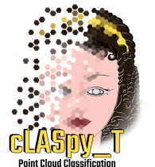

.. cLASpy_T documentation master file, created by
   sphinx-quickstart on Mon Jan 23 22:14:06 2023.
   You can adapt this file completely to your liking, but it should at least
   contain the root `toctree` directive.

********************************************
Welcome to cLASpy_T |version| documentation!
********************************************

|claspyt| means *'Tools for classification of LAS file with python and machine learning algorithms'* or **CLASsification LAS PYthon Tools**.

|claspyt| uses `scikit-learn`_ machine learning algorithms to classify 3D point clouds, such as LiDAR or Photogrammetric point clouds. Data must be provided in LAS ou CSV files. Other formats should be supported later (GEOTIFF or PLY), and other machine learning project too (`TensorFlow`_).

.. _scikit-learn: https://scikit-learn.org/stable/
.. _TensorFlow: https://www.tensorflow.org/

|claspyt| was developped to friendly use machine learning algorithms to classify or segment 3D point clouds.
Roughly, the software formats the input point clouds provided by LAS or CSV files to pandas `DataFrame`_ to be compatible with *Python* machine learning algorythms, such as `scikit-learn`_ or `TensorFlow`_.
|claspyt| writes the output classified point cloud in the same format of the input data, *i.e.* LAS or CSV.

.. _DataFrame: https://pandas.pydata.org/docs/reference/api/pandas.DataFrame.html

.. toctree::
   :maxdepth: 1
   :caption: Install:
   
   install/install.rst

.. toctree::
   :maxdepth: 3
   :caption: Usages:
   
   usage/usage.rst

.. toctree::
   :maxdepth: 1
   :caption: Tutorials:

   tutorials/tutorial1.rst

**CeCILL FREE SOFTWARE LICENSE AGREEMENT**

Version 2.1 dated 2013-06-21

**Notice**

This Agreement is a Free Software license agreement that is the result
of discussions between its authors in order to ensure compliance with
the two main principles guiding its drafting:

  * firstly, compliance with the principles governing the distribution
    of Free Software: access to source code, broad rights granted to users,
  * secondly, the election of a governing law, French law, with which it
    is conformant, both as regards the law of torts and intellectual
    property law, and the protection that it offers to both authors and
    holders of the economic rights over software.

The authors of the CeCILL (for Ce[a] C[nrs] I[nria] L[ogiciel] L[ibre])
license are:

Commissariat à l'énergie atomique et aux énergies alternatives - CEA, a
public scientific, technical and industrial research establishment,
having its principal place of business at 25 rue Leblanc, immeuble Le
Ponant D, 75015 Paris, France.

Centre National de la Recherche Scientifique - CNRS, a public scientific
and technological establishment, having its principal place of business
at 3 rue Michel-Ange, 75794 Paris cedex 16, France.

Institut National de Recherche en Informatique et en Automatique -
Inria, a public scientific and technological establishment, having its
principal place of business at Domaine de Voluceau, Rocquencourt, BP
105, 78153 Le Chesnay cedex, France.

*(See the 'license_en.txt' file)*

Indices and tables
==================

* :ref:`genindex`
* :ref:`modindex`
* :ref:`search`
