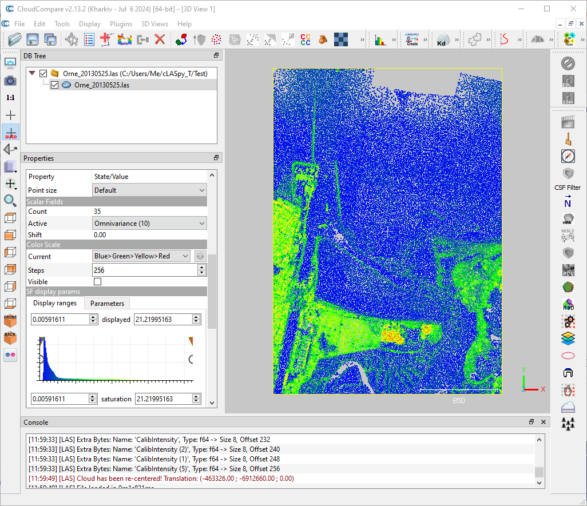

Tutorial 1: Basic test
=======================

This first tutorial will guide you through testing the correct installation of |claspyt|.
The tutorial assumes that the installation is clomplete and that the *venv* is operational.
If this is not the case, see :doc:`/install/install`. 

Explore Dataset
---------------
Using point cloud visualization software such as `CloudCompare`_, open the :file:`Test/Orne_20130525.las` file in the |claspyt| root directory.
You should see something like this:

.. note:: 

  This point cloud is too light (only 50,000 points) to correspond to a real use case, but it's useful to test that |claspyt| works.

To create an automatic classification model, different types of data are required. These are **labels**, which identify the class to which each point belongs, and **features**, which describe each point.

Labels
~~~~~~
Labels are contained in the **'Target'** scalar field.
You can view these labels by selecting the point cloud :file:`Orne_20130525.las`, then in :command:`Scalar Fields`, scroll down and select **'Target'**.
You see 9 classes, from 0 to 8 as follow:

1. Water
#. Wet sand
#. Dry sand
#. Mix (sand + mud)
#. Mud
#. Grass and Schorre
#. High vegetation and Buildings
#. Roads
#. Low vegetation

Features
~~~~~~~~
Features are all other scalar fields such as **'Roughness (5)'**, **'Omnivariance (10)'**, **'R'**, **'G'**, **'B'** or **'Return Number'**. 

The goal of a supervised machine learning algorithms is to model the membership of points to their **class**, or their **label/target**, based on input **features**.
The choice of these **features** is therefore essential for a consistent and robust **model**.

Test command-line
-----------------
The first step is to test |claspyt| command line, to ensure all library dependencies are properly installed.

You will create a classification model by running a training session using the light point cloud in the :file:`Test` folder of the |claspyt| sources.
This point cloud, :file:`Orne_20130525.las`, contains the **'Target'** scalar field and the **features** needed for training.

Then, you will use the model you created to make predictions on the same point cloud, to ensure that the **'predict'** module is also fully operational.

If all goes well, you should obtain a folder containing **4 files**: a model, a LAS point cloud and two reports, one for training and the other for prediction.

First run
~~~~~~~~~~
Activate the Python virtual environment (*venv*) created during installation process, from the :file:`cLASpy_T` folder.

On Windows:

.. code-block:: doscon

  C:\Users\Me\Code\cLASpy_T>.venv\claspy_venv\Scripts\activate

On Linux:

.. code-block:: console

  me@pc:~/Code/cLASpy_T$ source .venv/claspy_venv/bin/activate

|claspyt| consists of 3 modules: **'train', 'predict'** and **'segment'**.
The first and second are used to train a supervised model and make predictions.
The **'segment'** module perform unsupervised machine learning, with the **KMeans** algorithm.

You can get more details about |claspyt| and modules with :command:`--help` command. 

Example: help for **'predict'** module

.. code-block:: console

  python cLASpy_T.py predict --help

.. code-block:: console

  usage: cLASpy_T.py predict [-h] [-c] [-i] [-o] [-m] [--fillnan]

  -------------------------------------------------------------------------------

                            cLASpy_T
                        predict sub-command
                    =========================

  'predict' makes predictions on the input point cloud according the selected model.

  For predictions, two files are required:
    --> the input_data file with the same features used to create the model.
    --> the '*.model' file created during the training phase.

  -------------------------------------------------------------------------------

  options:
    -h, --help          show this help message and exit
    -c , --config       give the configuration file with all parameters
                            and selected scalar fields.
                            [WINDOWS]: 'X:/path/to/the/config.json'
                            [UNIX]: '/path/to/the/config.json'

    -i , --input_data   set the input data file:
                            [WINDOWS]: 'X:/path/to/the/input_data.file'
                            [UNIX]: '/path/to/the/input_data.file'

    -o , --output       set the output folder to save all result files:
                            [WINDOWS]: 'X:/path/to/the/output/folder'
                            [UNIX]: '/path/to/the/output/folder'
                            Default: '/path/to/the/input_data/'

    -m , --model        import the model file to make predictions:
                            '/path/to/the/training/file.model'

    --fillnan           set the value to fill NaN for feature values.
                            Could be 'median', 'mean', int or float.
                            Default: '--fillnan='median'

.. note::

  If it doesn't work, check the |claspyt| dependencies are installed, as explained in the :doc:`/install/install` section.

Training
~~~~~~~~
To train your first model with the **'train'** module, you need to set the algorithm and the input file.
All other arguments of **'train'** module are not mandatory. 

Run the following command to train a basic *RandomForestClassifier* model.

.. code-block:: console

  python cLASpy_T.py train -a=rf -i=./Test/Orne_20130525.las

* **-a**: set the supervised algorithm, here *rf* refers to *RandomForestClassifier*
* **-i**: set the point cloud file, here :file:`Orne_20130525.las`

**Training Ouput**

The first part of the terminal output shows the |claspyt| mode, the algorithm used and the input data file.

.. code-block:: console

  # # # # # # # # # #  cLASpy_T  # # # # # # # # # # # #
  - - - - - - - -    TRAIN MODE    - - - - - - - - - -
  * * * *    Point Cloud Classification    * * * * * *

  Algorithm used: RandomForestClassifier
  Path to LAS file: Test\Orne_20130525.las

  Create a new folder to store the result files... Done.

Once the file has been loaded, the output shows the LAS format and the total number of points. 
Then, the |claspyt| pipeline starts, with the input data formatted in pandas.DataFrame (see `10 minutes to pandas`_).

If no list of selected features is provided with :command:`--features (-f)` argument, the default behavior of |claspyt| is to retrieve all extra dimensions from the LAS file as selected features.
The standard LAS file dimensions are discarded by default.

The **'train'** module also search the **'Target'** field in the data and shows the labels used.
Here, there are 9 labels, from 0 to 8 as already seen with `CloudCompare`_.

.. code-block:: console

  LAS Version: 1.2
  LAS point format: 1
  Number of points: 50,000

  Step 1/7: Formatting data as pandas.DataFrame...

  All features in input_data will be used!
  Except X, Y, Z and LAS standard dimensions!

  LABELS FROM DATASET:
  [0, 1, 2, 3, 4, 5, 6, 7, 8]

The second step of the |claspyt| pipeline is the split of the dataset, as train and test sets, according to the :command:`--train_r`: the training ratio.
Here, the train and test sets are 25,000 points each, according the default :command:`--train_r` =0.5.

The third step scales the dataset according the :command:`--scaler` selected: *StandardScaler, MinMaxScaler or RobustScaler* (see `scalers`_).

.. code-block:: console

  Step 2/7: Splitting data in train and test sets...

  Random state to split data: 0
          Number of used points: 50 000 pts
          Size of train|test datasets: 25 000 pts | 25 000 pts

  Step 3/7: Scaling data...

.. warning:: 

  With large dataset, this step consumes a lot of RAM and can take a long time if memory is saturated.
  If |claspyt| stops at this stage with saturated RAM, reduce the size of the point cloud, 
  or increase the computer's RAM capacity.

Step 4/7 is the actual training of the model.
Depending on the size of the point cloud, the algorithm used and the number of features and classes, this step is normally the longest.
It can last from a few minutes to several hours.

The training uses the cross-validation method (CV for short) to ensure robust models.
So, 5 training are performed simultaneously on 5 subsets of trainset (see `cross-validation`_).
Here, the training set is composed of 25,000 points, so 5 subsets of 5,000 points are created.
Each subset (called a fold) is used once to test the model trained with the other 4 folds.

Once done, |claspyt| returns the global accuracy of the 5 sub-models.
To verify that the model is consistent and robust, check that the 5 scores are close to each other.
If one or more scores are several units (%) apart, there is a problem with the classes, features, model or training parameters.

.. code-block:: console

  Step 4/7: Training model with cross validation...

  Random state for the StratifiedShuffleSplit: 0

          Training model scores with cross-validation:
          [0.6934 0.6918 0.6898 0.6878 0.6862]

  Model trained!

.. note:: 

  Check CPUs are working to make sure that |claspyt| isn't freezing.
  The number of CPUs used by |claspyt| can be set with :command:`--n_jobs` argument.

After model trained, |claspyt| test it by making predictions on the test set of 25,000 points, created during step 2/7.
The results are presented in the form of a `confusion matrix`_ and a `classification report`_.

The `confusion matrix`_ allows to explore in detail the predictions made by the model for each of the expected classes.
The columns present the predictions made by the model, while the rows correspond to the expected classes for each point.
The end of each column corresponds to the **precision** of each class, while the end of each row corresponds to the **recall** of each class.
The **global accuracy** is the end of the last line, here: **69.6%**.

The `classification report`_ exposes the same results by classes, with the number of points for each class (support).

.. code-block:: console

  Step 5/7: Creating confusion matrix...

  CONFUSION MATRIX:
  Predicted         0         1        2        3        4         5         6        7         8  Recall
  True
  0          5064.000   194.000     1.00   16.000    3.000   126.000    21.000   32.000    10.000   0.926
  1           355.000  4635.000   367.00   34.000   27.000    29.000     3.000    7.000     2.000   0.849
  2             1.000   769.000  2347.00    4.000    0.000    19.000     1.000    7.000    24.000   0.740
  3           364.000   735.000    65.00  248.000   15.000   169.000     0.000   10.000     6.000   0.154
  4           115.000   794.000    16.00   92.000  151.000    89.000    44.000   75.000    40.000   0.107
  5           128.000    40.000    14.00   17.000    6.000  1808.000   200.000   14.000   417.000   0.684
  6            20.000     5.000    11.00    1.000    4.000    60.000  1324.000   35.000   419.000   0.705
  7           377.000    31.000    23.00    5.000   28.000    60.000   223.000  185.000   104.000   0.179
  8             2.000    17.000    53.00    2.000    1.000   168.000   420.000   16.000  1636.000   0.707
  Precision     0.788     0.642     0.81    0.592    0.643     0.715     0.592    0.486     0.616   0.696

  TEST REPORT:
                precision    recall  f1-score   support

            0       0.79      0.93      0.85      5467
            1       0.64      0.85      0.73      5459
            2       0.81      0.74      0.77      3172
            3       0.59      0.15      0.24      1612
            4       0.64      0.11      0.18      1416
            5       0.72      0.68      0.70      2644
            6       0.59      0.70      0.64      1879
            7       0.49      0.18      0.26      1036
            8       0.62      0.71      0.66      2315

      accuracy                           0.70     25000
    macro avg       0.65      0.56      0.56     25000
  weighted avg       0.69      0.70      0.66     25000

The step 6/7 save the model, and all other needed parameters such as scaler, in a binary file with a :file:`.model` extension.
*This binary file is created with joblib python library.*

The last step writes all relevant training parameters to a report file.

.. code-block:: console

  Step 6/7: Saving model and scaler in file:

  Model path: Test\Orne_20130525/
  Model file: train_rf50kpts_1217_1619.model

  Step 7/7: Creating classification report:
  Test\Orne_20130525/train_rf50kpts_1217_1619.txt

  Training done in 0:00:03.095406

Prediction
~~~~~~~~~~

Test Graphical User Interface (|gui|)
-------------------------------------

.. _CloudCompare: https://www.cloudcompare.org/
.. _10 minutes to pandas: https://pandas.pydata.org/docs/user_guide/10min.html#min
.. _scalers: https://scikit-learn.org/stable/auto_examples/preprocessing/plot_all_scaling.html
.. _cross-validation: https://scikit-learn.org/stable/modules/cross_validation.html
.. _confusion matrix: https://scikit-learn.org/stable/modules/model_evaluation.html#confusion-matrix
.. _classification report: https://scikit-learn.org/stable/modules/model_evaluation.html#classification-report